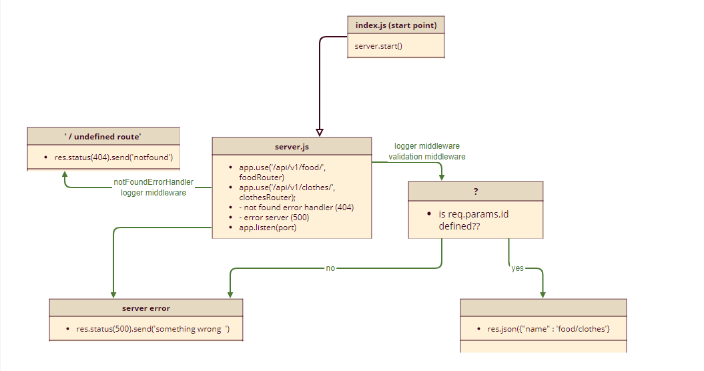

# 
# Lab 2-401 course basic-api-server

## links:
- [heroku link](https://basic-express-server-faten.herokuapp.com/)

- [Github actions link](https://github.com/Fatensamman/basic-express-server/actions)

- [pull request link](https://github.com/Fatensamman/basic-express-server/pull/1)

## End Points
-  saved clothes data route *https://basic-express-server-faten.herokuapp.com/api/v1/clothes/*
-  one recorded clothes data route *https://basic-express-server-faten.herokuapp.com/api/v1/clothes/<id>*
-  saved food data route *https://basic-express-server-faten.herokuapp.com/api/v1/food/*
-  one recorded food data route *https://basic-express-server-faten.herokuapp.com/api/v1/food/<id>*

## setup  environment

### Install
- initialization using  `npm inint -y`
- install libraries like express dotenv cors morgan uuid
- install devDependencies like jest supertest eslint
- create files tree

### Test
- test 404 status  on a bad route
- The correct status codes and returned data for each REST route
     Create a record using POST
     Read a list of records using GET
     Read a record using GET
     Update a record using PUT
     Destroy a record using DELETE
 using `npm test `
 - testing lint using `npm run lint`

 ## Documentation:
 